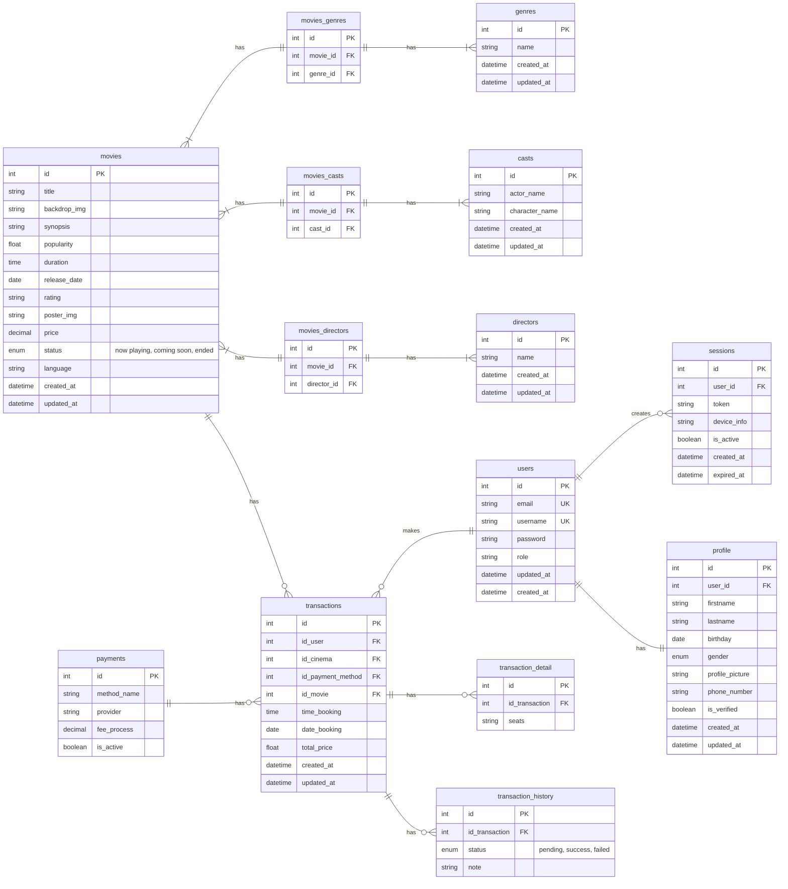

# ERD: Cinemax

```mermaid


erDiagram
    direction LR

    users ||--o{ sessions :"creates"
    users ||--|| profile : "has"

    movies_genres||--|{ genres: "has"
    movies }|--|| movies_genres: "has"
    movies_casts||--|{ casts: "has"
    movies }|--|| movies_casts: "has"
    movies }|--|| movies_directors :  "has"
    movies_directors||--|{ directors: "has"

    transactions }o--||users : "makes"
    movies ||--o{ transactions : "has"
    transactions ||--o{ transaction_detail : "has"
    transactions ||--o{ transaction_history : "has"
    payments ||--o{ transactions : "has"


    users {
        int         id            PK
        string      email         UK
        string      username      UK
        string      password      
        string      role
        datetime    updated_at
        datetime    created_at
    }

    sessions {
        int       id            PK
        int       user_id       FK
        string    token
        string    device_info
        boolean   is_active
        datetime  created_at
        datetime  expired_at
    }

    profile {
        int         id            PK
        int         user_id       FK
        string      firstname
        string      lastname
        date        birthday
        enum        gender
        string      profile_picture
        string      phone_number
        boolean     is_verified
        datetime    created_at
        datetime    updated_at
    }

    movies {
        int         id              PK
        string      title
        string      backdrop_img
        string      synopsis
        float       popularity
        time        duration
        date        release_date
        string      rating
        string      poster_img
        decimal     price
        enum        status          "now playing, coming soon, ended"
        string      language
        datetime    created_at
        datetime    updated_at
    }

    movies_casts{
        int     id              PK
        int     movie_id        FK
        int     cast_id         FK
    }
    casts {
        int       id            PK
        string    actor_name
        string    character_name
        datetime  created_at
        datetime  updated_at
    }

    movies_genres{
        int    id           PK
        int    movie_id    FK
        int    genre_id    FK
    }
    genres {
        int       id        PK
        string    name
        datetime  created_at
        datetime  updated_at
    }

    movies_directors{
        int    id              PK
        int    movie_id       FK
        int    director_id    FK
    }
    directors {
        int       id           PK
        string    name
        datetime  created_at
        datetime  updated_at
    }
    transactions {
        int id  PK
        int id_user FK
        int id_cinema   FK
        int id_payment_method   FK
        int id_movie    FK
        time    time_booking
        date    date_booking
        float   total_price
        datetime    created_at
        datetime    updated_at
    }
    transaction_detail{
        int id  PK
        int id_transaction  FK
        string  seats
    }
    transaction_history{
        int     id  PK
        int     id_transaction  FK
        enum    status "pending, success, failed"
        string  note
    }
    payments {
        int     id              PK
        string  method_name
        string  provider
        decimal fee_process
        boolean is_active
    }


```